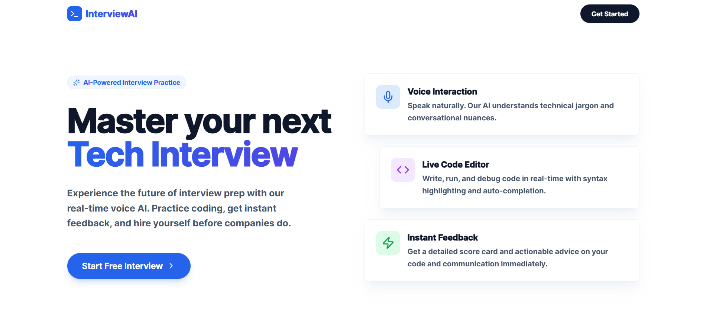
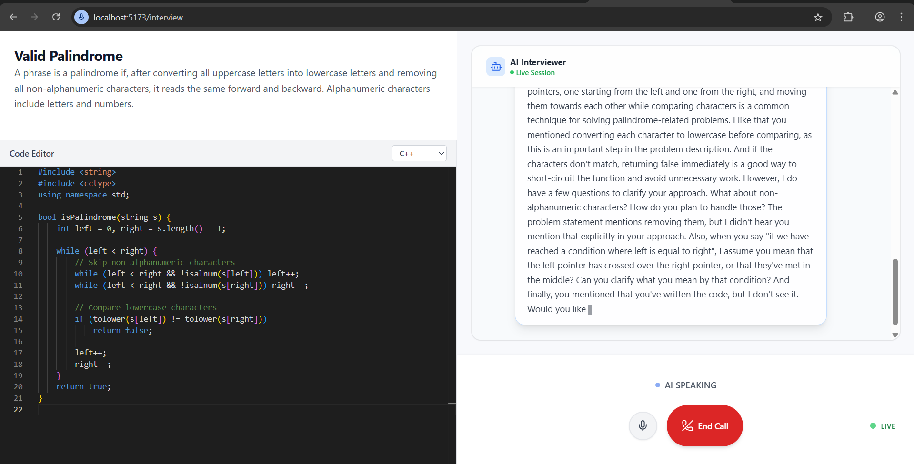
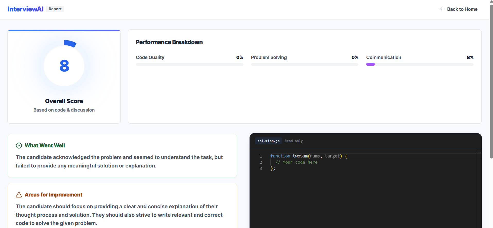

# AI Technical Interview Platform

A real-time, voice-enabled technical interview platform that simulates a coding interview environment. It features a conversational AI agent that presents algorithmic problems, listens to the candidate's approach, and provides feedback, alongside a synchronized code editor and real-time transcription.

### How It Works

The platform simulates a realistic technical interview loop:

1.  **Problem Presentation**: The AI Agent introduces a coding problem (e.g., "Two Sum") based on the interview context.
2.  **Clarification & Approach**:
    *   *Candidate*: "Should I optimize for time complexity?"
    *   *Agent*: "Yes, aim for O(n) if possible. Do you have a specific data structure in mind?"
3.  **Live Coding**:
    *   *Candidate*: types code in the Monaco editor.
    *   *System*: The code is synced in real-time to the Agent via LiveKit Data Channels, allowing immediate analysis.
4.  **Feedback & Iteration**:
    *   The agent observes the code and provides hints if the candidate is stuck.
    *   *Agent*: "I see you're using a nested loop. Is there a way to do this with a hash map?"
5.  **Completion**:
    *   The session ends with a summary of the candidate's performance.

## Screenshots

<div align="center">
  
  
  <br/>
  
</div>


## System Architecture

The project consists of three decoupled services:

1.  **Frontend (`/frontend`)**: A React application built with Vite. It handles the user interface, including the Monaco Code Editor, real-time transcription display, and WebRTC connection to LiveKit.
2.  **Backend (`/backend`)**: A Node.js/Express server. It manages authentication, generates LiveKit access tokens, and handles session persistence via MongoDB.
3.  **Voice Agent (`/agent`)**: A Python service using the LiveKit Agents framework. It manages the AI lifecycle, listening to audio and **real-time code updates** to provide context-aware feedback. Uses Deepgram (STT/TTS) and Groq (LLM).

## Prerequisites

-   Node.js v16+
-   Python 3.9+
-   Docker (optional, for deployment)
-   LiveKit account (Cloud or Self-hosted)
-   API Keys: Groq, Deepgram, ElevenLabs

## Environment Configuration

Create a `.env` file in each respective directory based on the provided `.env.example` files.

### 1. Agent (`agent/.env`)
```env
LIVEKIT_URL=
LIVEKIT_API_KEY=
LIVEKIT_API_SECRET=

GROQ_API_KEY=
DEEPGRAM_API_KEY=
```

### 2. Backend (`backend/.env`)
```env
PORT=
MONGO_URI=

LIVEKIT_URL=
LIVEKIT_API_KEY=
LIVEKIT_API_SECRET=
```

### 3. Frontend (`frontend/.env`)
```env
VITE_BACKEND_URL=http://localhost:3000
```

## Local Development

### 1. Backend

Navigate to the backend directory and start the server:

```bash
cd backend
npm install
npm run dev
```
Server runs on: `http://localhost:3000`

### 2. Frontend

Navigate to the frontend directory and start the development server:

```bash
cd frontend
npm install
npm run dev
```
Application runs on: `http://localhost:5173`

### 3. Voice Agent

Navigate to the agent directory. It is recommended to use a virtual environment.

```bash
cd agent
python -m venv venv
venv\Scripts\activate
pip install -r requirements.txt
python agent.py dev
```

